Android 旅遊景點介紹APP
-------------
完成以下功能
1. 帳號註冊登入功能
2. 密碼查詢功能
3. 旅遊景點介紹
4. 標題關鍵字搜尋
5. 多日遊景點新增
6. 旅遊景點評論與給星評分
7. 旅遊指南的資訊
8. 資料庫使用SQLite

| 登入 | 帳號註冊 |
| :----: | :----: |
|  | |

| 密碼查詢 | 旅遊搜尋 |
| :----: | :----: |
|  | |

| 景點內容 | 行程規劃 |
| :----: | :----: |
| 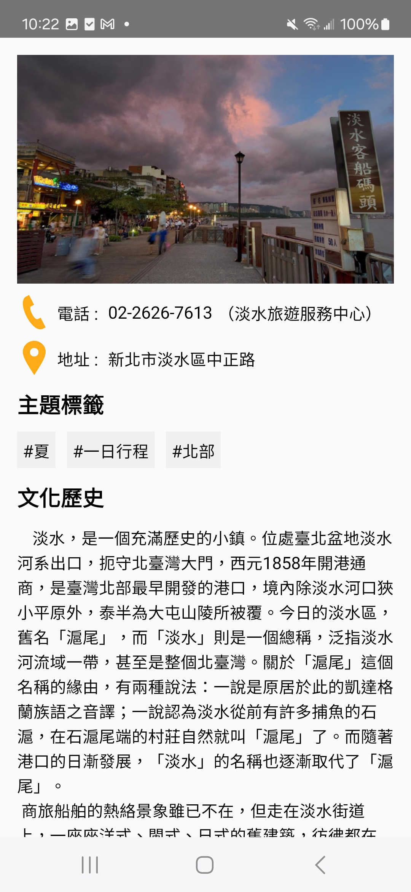 | 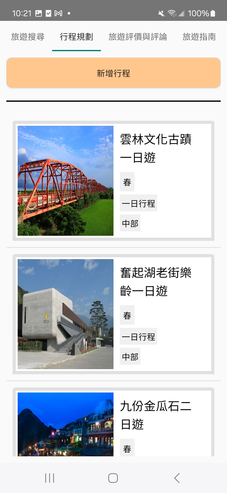|

| 新增行程 | 多日遊內容 |
| :----: | :----: |
| 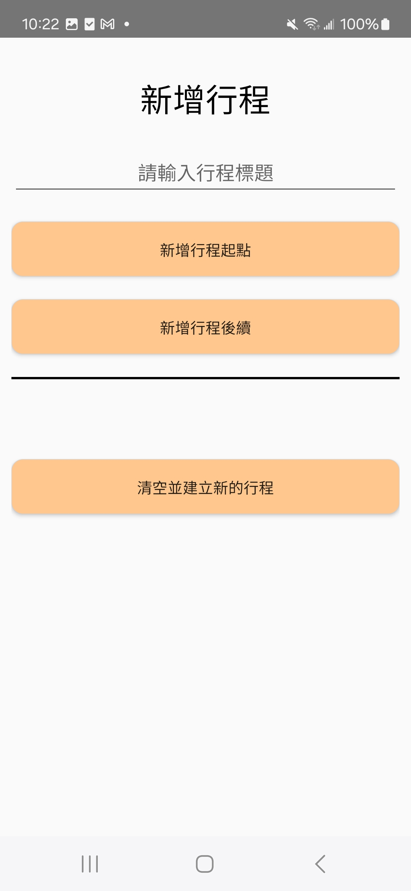 | 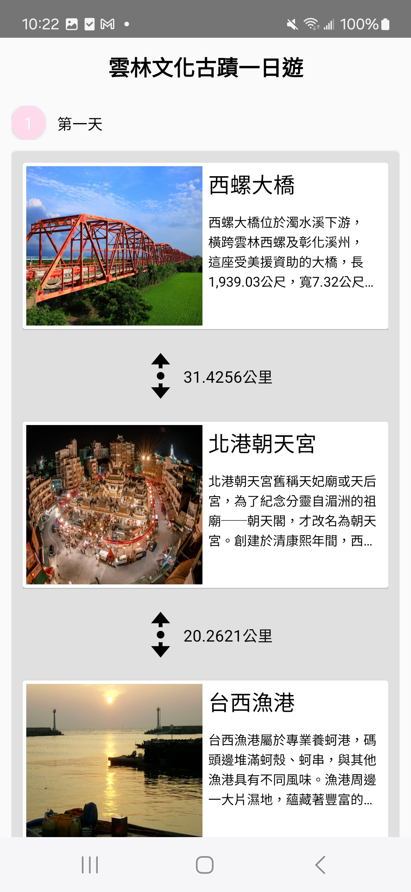|

| 旅遊評價與評論 | 評論 |
| :----: | :----: |
| 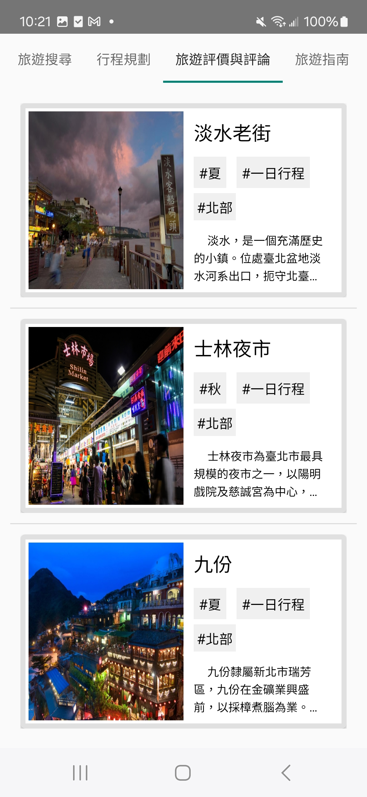 | 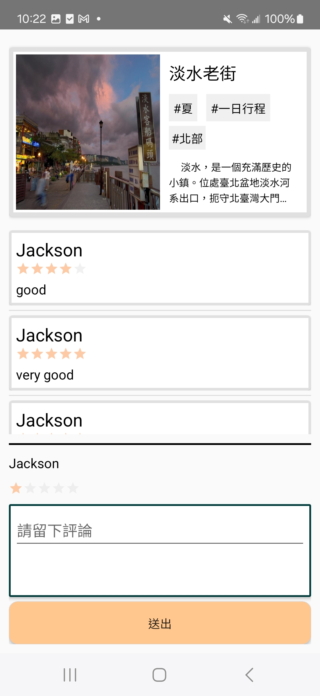|

| 旅遊指南 | 入出境須知 |
| :----: | :----: |
| 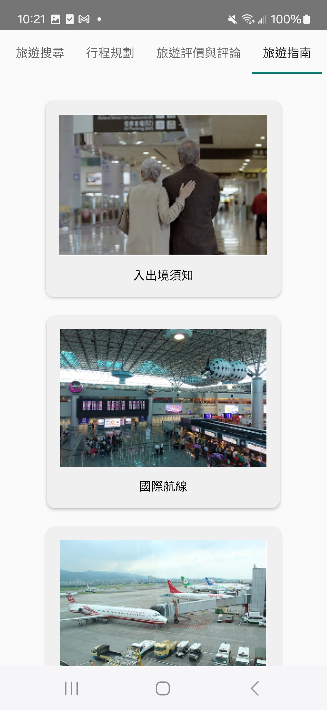 | 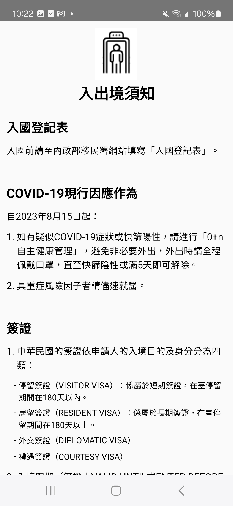|

| 國際航線 | 國內航線 |
| :----: | :----: |
| 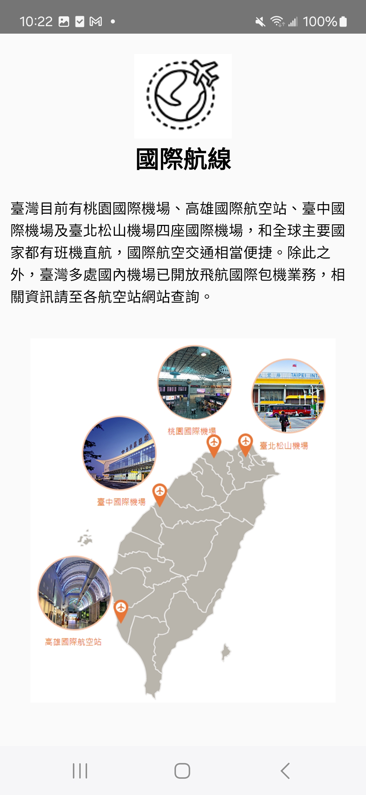 | 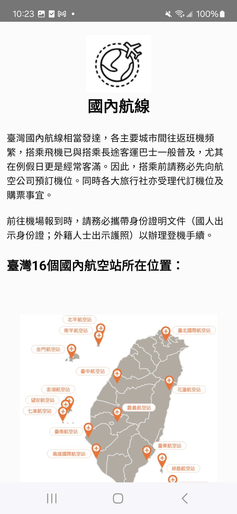|

| 國內航線 | 國內航線2 |
| :----: | :----: |
|  | 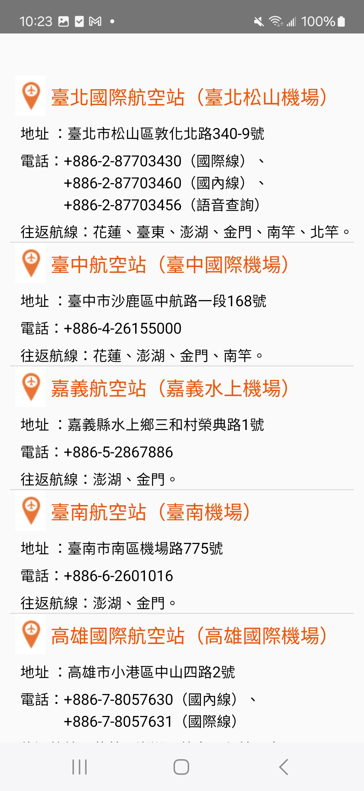|
